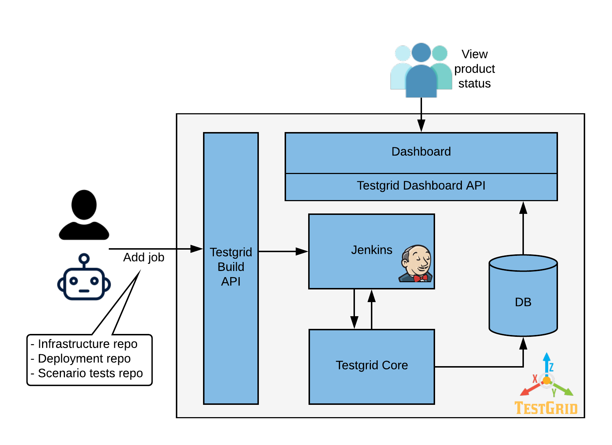
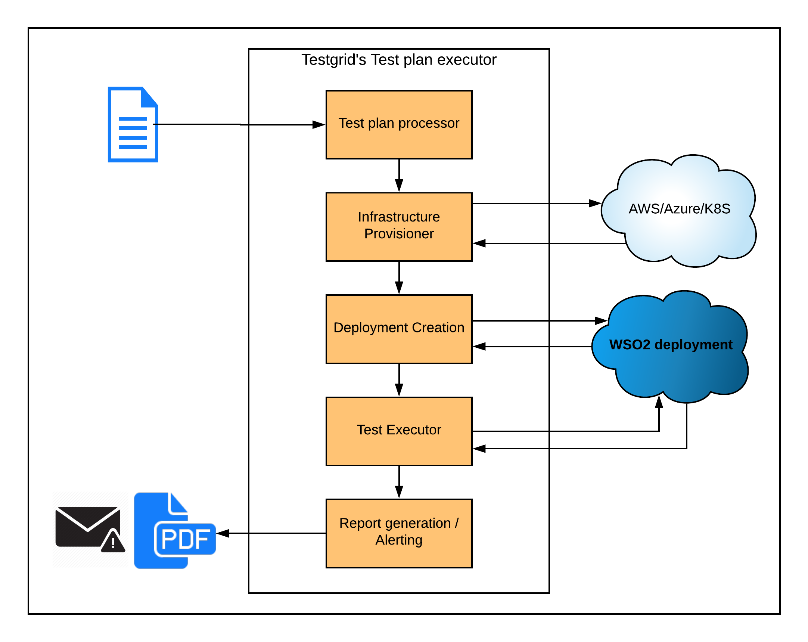

# WSO2 TestGrid

Welcome to main repo of WSO2 TestGrid.

TestGrid strengthens the positioning of WSO2 products and adds major value to the subscriptions WSO2 offers. Following are some benefits TestGrid provide:

1. TestGrid tests entire feature-set of our products (APIM/IS/EI/SP/IOT) against a wide-array of supported infrastructure combinations.
In essence, we add value to what we have claimed at [Tested DBMSs](https://docs.wso2.com/display/compatibility/Tested+DBMSs),
 [Tested Operating Systems and JDKs](https://docs.wso2.com/display/compatibility/Tested+Operating+Systems+and+JDKs),
 and more.

 Here's a conversation that may highlight the value of Testgrid at WSO2:

> _User asks_  : Does WSO2 IS support IBM JDK 8 with DB2 database on AIX
operating system?

> _WSO2 response_ : Yes, IS has been tested exactly against this set of
combinations, and is proven to work.
> You can find the current status of this infrastructure combination in
the WSO2 TestGrid's dashboard at testgrid-live.wso2.example.com.

2. Users get to validate their WSO2 deployments through the scenario test
support we provide.

3. Users get to see a document with a set of user stories each having
scenario test scripts. Each scenario test script will test for minor
configuration variations (like caching enabled/disabled).
This document will provide a single source of truth for user stories.
See the current development at
[identity-test-integration](https://github.com/wso2-incubator/identity-test-integration/blob/master/README.md
), and [apim-test-integration](https://github.com/wso2-incubator/apim-test-integration/blob/master/README.md)
repositories.

## Where to go next from here?

1. Read the quick architecture details below
2. Do the [quick start guide](docs/QuickStartGuide.md), and get a local testgrid running
3. Read the Testgrid concepts at [Infrastructure / Deployment / and Scenarios Repository Structure](docs/Infrastructure-Deployment-Scenarios-Repository-Structure.md)
4. See developer docs at [How to Pass Data between Testgrid steps](docs/How-to-Pass-Data-to-Next-Steps.md)

## Building Testgrid

You need Oracle JDK 8, Node JS, MySQL Server 5 and Apache Maven 3.5 to build Testgrid.

`mvn clean install`

NOTE: For Ubuntu/Debian to install NodeJS, issue the following commands
1. `sudo apt update`
2. `sudo apt install nodejs`

## Testgrid architecture

### Overall system components are as follows:

* Testgrid uses Jenkins as the runtime engine due to its CI capabilities that
closely matches with some of the key requirements for testgrid's
function. They include:

1. Mature master-slave architecture: Jenkins provides a scalable model for
TestGrid to execute multiple test-runs in parallel. The slave nodes can be
scaled up and down depending on the size of the build queue.
This allows TestGrid to be highly scalable which is a key requirement when
the number of infrastructure combinations grow.
2. Build triggers for running builds periodically, per git pull-request merge etc.
3. Scripting support: Jenkins2 provides scripting of builds through
Jenkins Pipelines.

* TestGrid Core - TestGrid core is a library that knows how to execute a given
test-plan. In TestGrid, Jenkins is the runtime execution engine, and the
TestGrid Core is just a library. Jenkins is the one that instruct the TestGrid
Core to execute test-plans, publish reports etc. as appropriate.

* TestGrid Database - TestGrid test-run status is persisted in a database.
The TestGrid Core store the build data in here. It includes the tested products
(ie. product name+version), deployment patterns, and the test status of each
scenario.
Please find the [ER diagram](docs/erd/testgrid-erd.png).

* Dashboard - Dashboard shows the build status of durable jobs.

### Testgrid core execution flow

Given a test-plan as an input, testgrid core knows where to
find the infrastructure-as-code repo, product deployment scripts (puppet?),
and test scripts. It can then execute the testgrid's three-step
execution flow:

1. Provision infrastructure (AWS/K8S/Azure)
2. Create the deployment (Puppet/Shell scripting)
3. Execute test scripts (JMeter / TestNG (via maven))

